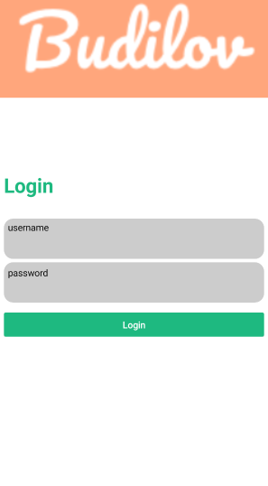

### JetPack Compose with Amazon Cognito Starter

#### Author: Vladimir Budilov
* [LinkedIn](https://www.linkedin.com/in/vbudilov/)
* [Medium](https://medium.com/@budilov)

#### What is it?
The project is meant to familiarize myself with JetPack Compose since that's going to be the dominant Android UI framework once it's released. It's similar to React Native and Flutter, although it's specific to Android and doesn't support
cross-OS compilation. 

#### Progress so far
The code is very messy and needs a lot of work, but the point was to get my hands dirty with JetPack Compose (don't judge)

1. done: Simple navigation between top-level screens
2. done: Login functionality
3. todo: Registration
4. todo: Password reset
5. todo: input validation
6. todo: a lot more, like adding Amazon Amplify DataStore. 


#### Simple Instructions

0. Before working with this project you need to setup a [Cognito User Pool](https://docs.aws.amazon.com/cognito/latest/developerguide/cognito-user-identity-pools.html) and 
add an 'awsconfiguration.json' with the appropriate user pool configurations under './app/src/main/res/raw/' 
(more instructions [here](https://aws-amplify.github.io/docs/android/authentication#manual-setup)):

```json
    {
        "IdentityManager": {
            "Default": {}
        },
        "CognitoUserPool": {
            "Default": {
                "PoolId": "XX-XXXX-X_abcd1234",
                "AppClientId": "XXXXXXXX",
                "AppClientSecret": "XXXXXXXXX",
                "Region": "XX-XXXX-X"
            }
        }
    }
```


1. Install the [Android Studio Canary build](https://developer.android.com/studio/preview). This project only works with the canary version since it needs a special Kotlin compiler
2. Clone this project
3. Open the project with Android Studio
4. Under the 'Run' tab select 'Run app'
5. Enjoy

#### UI

My goal wasn't to create the most beautiful app so the UI will eventually improve, but here's what a login screen looks like:



